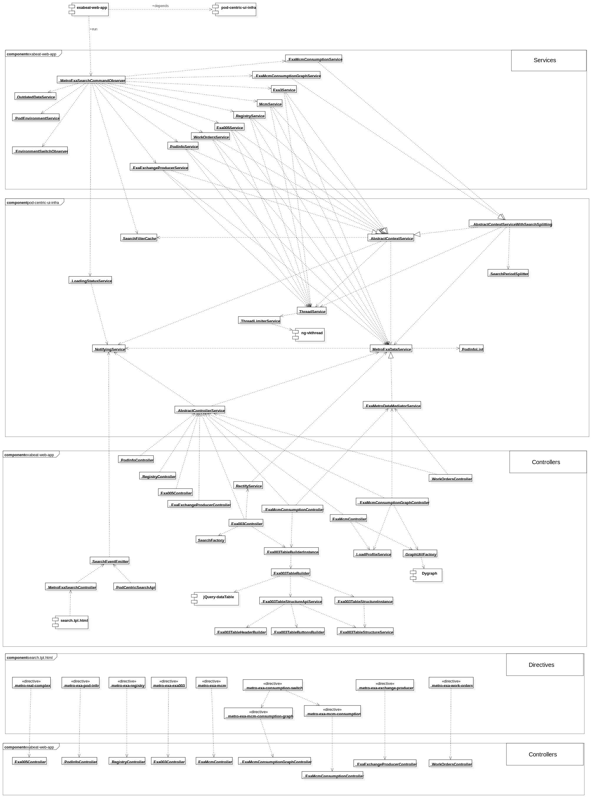

# pod-centric-ui-exploration
An experimental exploratory app to solve a business problem with several contraints. 
The app proof the use of 
- worker threads to fetch the data, 
- a singleton service to hold the data and 
- a message based communication model to request the data and react when it is gathered.

After few month of work, with the great contribution from @vacammar, the base idea evolved into the core of a production application, 
here shown from a component perspective with an UML component diagram.

